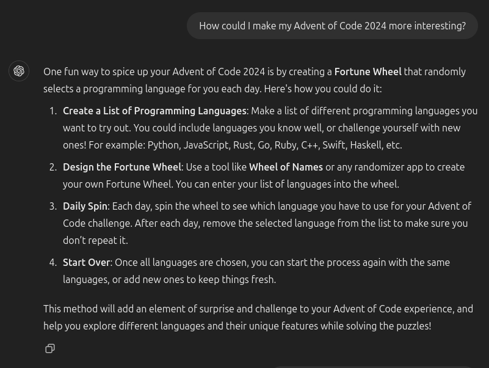

# AoC2024 🎄

My Solutions for the Advent of Code-Problems of 2024.

## Code Roulette Mode ⚡

Because i got to know some new programming languages this year and to spice up the AoC 2024 for me, i use a fortune wheel to choose my programming language that i solve the problem in.

After a programming language has been chosen, it will be removed from the list until no language is left. Once the list is empty, it will be refilled with all the languages again.

My programming list consists of:

-   **C**
-   **C++**
-   **C#**
-   **Rust**
-   **Javascript**
-   **Typescript**
-   **Python**

I got the most knowledge in C#, Java- and Typescript but want to use this year as a incentive to work with other languages as well.

